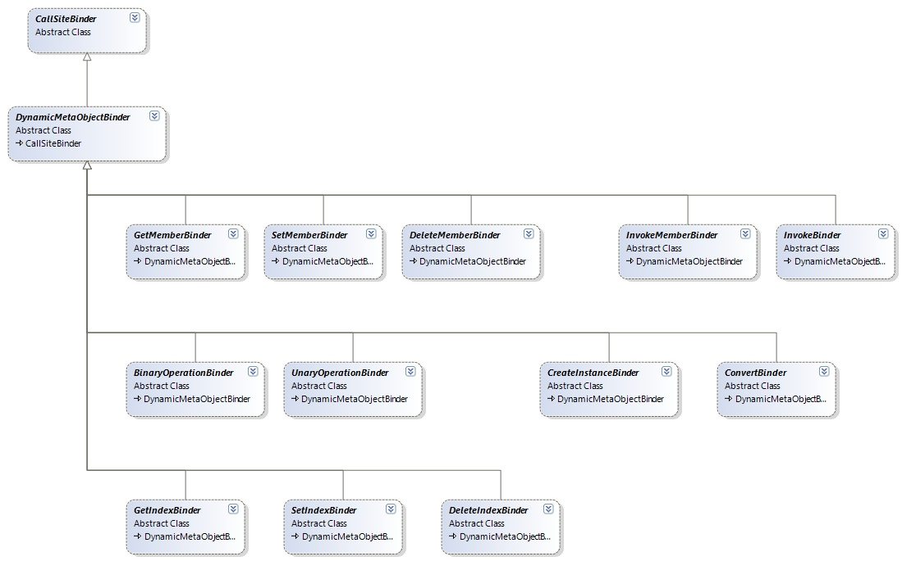

# 3 Walkthrough of Hello World

We're going to start with walking through the infrastructure needed for Hello World. This section explains a lot of important concepts in the DLR needed to start implementing a language using the DLR. Later sections discuss the remaining concepts, which come in two forms as Sympl gains features. One is different kinds of dynamic call sites and runtime binders, and the other is simple syntax tree translations to Expression Trees. Do NOT skip this section just because it is Hello World!

This is the Sympl program to get working end-to-end:

(import system)

(system.console.writeline "hey")

If the above code were in test.sympl, the host code snippet is (see program.cs):

static void Main(string\[\] args) {

string dllPath = typeof(object).Assembly.Location;

Assembly asm = Assembly.LoadFile(dllPath);

Sympl s = new Sympl(new Assembly\[\] { asm });

s.ExecuteFile("test.sympl");

This two line Sympl program requires a surprising amount of support if you do not cut corners such as having a built-in print function. The needed language implementation pieces are:

- Lexical scanning and Parsing to an abstract syntax tree (AST).

- Analysis -- is the program well-formed semantically and to what variables do identifiers refer.

- Code generation -- made much simpler by using the DLR's Expression Trees. Sympl emits Expressions directly from its analysis pass over an input program.

- Hosting -- how you cause a Sympl program to execute and give it access .NET assemblies, namespaces, and types.

- Reflection over .NET assemblies and types.

- Runtime helper functions -- for example, performing import and binding helpers.

- Dynamic object helpers.

- File modules or scopes -- do files provide some name isolation as in python or none at all as in elisp. Sympl has file globals. Import brings names from .NET assemblies and host globals into a file module in Sympl.

- Keyword forms -- for example, import, defun, let\*, new, set, +, &lt;, and so on.

- Function call.

- Name resolution and global variable lookup.

- Member access -- system.console

- Member invocation -- console.writeline

This document focuses on the DLR pieces and key points of learning. It explains some of the implementation or language semantics as needed to make sure you know why Sympl needed some piece of infrastructure. This document won't dwell on every detail, and won't explain components such as the lexer or parser. These are pretty simple and straightforward even if you've never implemented them before, just check out lexer.cs and parser.cs.

<h2 id="quick-code-overview">3.1 Quick Code Overview</h2>

This document excerpts relevant code while discussing parts of the Sympl implementation. If you want to see the code snippets in situ, this is a breakdown of the code.

**Lexer.cs** -- as you'd expect, this is the lexical scanner. The main entry points are GetToken and PutToken.

**Parser.cs** -- again, as you'd expect, the parser takes a stream of tokens from the lexer and builds a syntax tree (AST). The IronPython implementation of Sympl just has top-level functions in the parser.py module, but the lexer.py defines a class to hold tokens for PutToken. The main entry points are ParseFile and ParseExpr, which take TextReaders.

**Etgen.cs** -- Sympl collapses the semantic analysis and code generation phases into one. Sympl's analysis is pretty trivial and combined with using Expression Trees for your code generation, there's no reason to be more complicated. If you had Python's lexical rules, or classes with smarter identifier resolution semantics, you would need to make a first pass over the AST to analyze and bind names. The main entry point is AnalyzeExpr.

**Runtime.cs** -- here is where Sympl defines all the runtime binders, runtime helper functions, dynamic object helpers, and some built-in types such as Symbol and Cons. Runtime.py has some of the code in it that sympl.cs has so that the python modules layer nicely, but since all the C\# code is in one namespace, some classes sit in the file in which they are used.

**Sympl.cs** -- primarily this holds the Sympl hosting class which you instantiate to run Sympl code. This also has some runtime support, either instance methods on Sympl or support classes used by the hosting class. Some of this latter code is in runtime.py for python module layering that wasn't necessary in C\#.

Program.cs -- main just runs the test.sympl file and then drops into a REPL for testing and playing with code in the test module. This can be useful for trying out one expression at time and changing breakpoints in VS to watch the implementation flow.

<h2 id="hosting-globals-and-.net-namespaces-access">3.2 Hosting, Globals, and .NET Namespaces Access</h2>

This section talks about hosting only a bit for now, as hosting relates to host Globals and accessing .NET namespaces and types. There is a Sympl class that programs can instantiate to create a Sympl runtime. When you create the runtime, you provide one or more assemblies whose namespaces and types Sympl programs can access when executing within this runtime. The Sympl runtime has a Globals table. Hosts and add globals to this table, and Sympl fills it with the available namespaces and types.

Sympl leverages the DLR's ExpandoObjects as a trivial implementation of its Globals table. Sympl does not use a .NET dictionary for a couple of reasons. The first is that Sympl needs a DLR based dynamic object to hold its globals so that programs can use late binding to access variables. Sympl uses the DLR's DynamicExpression for GetMember operations with runtime binder metadata to look up names case-INsensitively. This approach means Sympl modules can interoperate as dynamic objects with other languages and libraries. The second reason to use ExpandoObjects is that the DLR has a fast implementation for accessing members.

The Sympl.Globals table is the root of a tree of ExpandoObjects. Each interior ExpandoObject node represents one .NET namespace. For each sub namespace within it, there is a nested ExpandoObject representing each sub namespace. The leaf nodes are TypeModel objects that Sympl defines. Sympl cannot store .NET RuntimeType objects because when Sympl programs dot into the type objects, the Sympl code wants to bind names to the types represented by the RuntimeType objects. The code does not want to bind names to the members of the type RuntimeType. We'll go through this in detail below.

This is Sympl's reflection code, which is pretty simple, while IronPython's is much richer and also tuned for startup performance (from sympl.cs):

public void AddAssemblyNamesAndTypes() {

foreach (var assm in \_assemblies) {

foreach (var typ in assm.GetExportedTypes()) {

string\[\] names = typ.FullName.Split('.');

var table = \_globals;

for (int i = 0; i &lt; names.Length - 1; i++) {

string name = names\[i\].ToLower();

if (DynamicObjectHelpers.HasMember(

(IDynamicMetaObjectProvider)table, name)) {

table = (ExpandoObject)(DynamicObjectHelpers

.GetMember(table,

name));

} else {

var tmp = new ExpandoObject();

DynamicObjectHelpers.SetMember(table, name,tmp);

table = tmp;

}

}

DynamicObjectHelpers.SetMember(table,

names\[names.Length - 1\],

new TypeModel(typ));

}

}

}

<h3 id="dlr-dynamic-binding-and-interoperability----a-very-quick-description">3.2.1 DLR Dynamic Binding and Interoperability -- a Very Quick Description</h3>

Before explaining how Sympl fills the Sympl.Globals table with models of namespaces and types, you need to be familiar with how dynamic CallSites work. This is a brief, high-level description, but you can see the sites-binders-dynobj-interop.doc document on [www.codeplex.com/dlr](http://www.codeplex.com/dlr) for details of the concepts and mechanisms. CallSites are one of the top benefits of using the DLR. They are the basis of the DLR's fast dynamic method caching. They work together with DLR runtime binders and dynamic objects to enable languages and dynamic library objects to interoperate.

The DLR has a notion of dynamic operations that extend beyond method invocation. There are twelve kinds of operations designed for interoperability, such as GetMember, SetMember, InvokeMember, GetIndex, Invoke, CreateInstance, BinaryOperation, UnaryOperation, and so on. See diagram below. They require runtime binding to inform a CallSite how to perform an operation given the object or objects that flowed into the call site. Binders represent the language that owns the CallSite as well as metadata to inform the binding search. Binders return a sort of rule, entailing how to perform the operation and when the particular implementation is appropriate to use. CallSites can cache these rules to avoid future binding searches on successive executions of the CallSite.

Figure : Twelve Standard Interop Binders

This is the basic flow end-to-end for binding a dynamic operation in the DLR when there is a cache miss (explained in detail below):

1.  Your language compiles a method invocation or binary operation to an Expression Tree DynamicExpression, which the DLR compiles to a CallSite. The DynamicExpression's operation is defined by the CallSiteBinder you placed in the expression and the metadata contained in that binder instance.

2.  When execution of the containing program comes to the call site, the DLR has emitted code to invoke the CallSite's Target delegate. Initially, this target delegate simply calls on the binder you provided to get a rule for how to perform the operation. Ignoring more advanced options, there are no implementations cached at this point. Any time there is a cache miss, the CallSite calls on the binder to search for how to perform the operation.

3.  The CallSite calls BindDelegate, which the base CallSiteBinder type handles. You almost never need to implement at this level. You'll probably only need to use DynamicMetaObjectBinders, which allow you to participate in the DLR's interoperability protocol. The CallSiteBinder base implementation of BindDelegate calls its abstract Bind method to get an Expression that embodies the rule (a test for when the rule is valid and the implementation of the operation given the current arguments).

4.  DynamicMetaObjectBinder provides a base implementation of Bind that wraps all the arguments in DynamicMetaObjects and calls its own abstract Bind overload that takes DynamicMetaObjects. This is where dynamic objects, which implement IDynamicMetaObjectProvider, get to insinuate themselves in the binding process. Meta-objects represent a value in the binding process for binders that derive from DynamicMetaObjectBinder. DynamicMetaObjects support dynamic objects being king of their own binding logic. They also are the means of interoperability across languages and libraries, as well as allowing several operations to combine into one (for very advanced cases). Meta-objects also represent the results of binding, which is explained further in the sites-binders-dynobj-interop.doc document. When DynamicMetaObjectBinder calls Bind on DynamicMetaObjects, execution flows to one of the twelve binder types (see diagram) that define the standard interoperability operations. InvokeMemberBinder is an example.

5.  The twelve standard interoperability binder types all provide sealed implementations of the Bind method that takes DynamicMetaObjects. These implementations call on the first argument to ask it to provide a binding for the operation. This is part of the interoperability protocol. The DLR gives precedence to the object, represented by its DynamicMetaObject, to determine how to perform the operation. The DynamicMetaObject may take various actions, including falling back to the binder to compute the binding. The DLR's default DynamicMetaObjects, which wrap regular .NET objects, always just calls on the language binders to get a binding.

<!-- -->

1.  The target DynamicMetaObject may return a new DynamicMetaObject that represents the result of the operation. The result is the Expression property of the DynamicMetaObject. Combined with the result DynamicMetaObject's restrictions, CallSiteBinder can form a rule as a delegate. For example, the target object for an InvokeMember operation might be an IronRuby object. It would look at the metadata on the binder (the name to invoke and the ignoreCase flag). If it could find the member, and it is callable, it would provide the binding for how to perform the operation on this kind of object.

2.  The target DynamicMetaObject might not be able to find the member, so it would call your binder's FallbackInvokeMember. The dynamic object got first chance to handle the operation, but it calls on the language that owns the compiled line of code. There are two reasons for this part of the protocol. The first is that the language binder might manufacture a member on the object, such as standard members that all objects in a particular language are expected to have. The second reason is that even if your language doesn't add members to all objects, like Sympl, the language's binder gets the chance to return a DynamicMetaObject representing an error that is in the expected style of the language. The language binder has a couple of responsibilities or options, such as COM support and handling DynamicMetaObjects that have no concrete value at binding time. Sympl adds these to its binders late in Sympl's evolution.

3.  The target DynamicMetaObject might know how to perform GetMember but not InvokeMember, like Python meta-objects. Then it could make a DynamicMetaObject representing the result of performing a GetMember operation and call the binder's FallbackInvoke method. This gives the language owning the line of code the opportunity to apply its semantics for argument conversions to match a callable object. For example, does it convert nil to false or throw an error that you cannot bind the call.

<!-- -->

1.  NOTE, DynamicMetaObjects and binders should NEVER throw when they fail to bind an operation. Of course, they throw if there's some internal integrity error, but when they cannot produce a binding for an operation, they should return a DynamicMetaObject representing a Throw expression of an appropriate error so that the binding process finishes smoothly. The reason is that another DynamicMetaObject or binder down the chain of execution might handle the operation. There are situations described later where DynamicMetaObjects call on binders to get their rule or error meta-object to fold those into the result the DynamicMetaObject produces.

2.  Now suppose execution flows into your language's binder via a call to FallbackOP (for some OP, see the standard interoperability binders' members). This happens when the DynamicMetaObject, as described above, fails to find a binding and asks the owning language to do the binding. OP is the root name of the binder, which is also the name of one of the twelve base interoperability operations (GetMember, InvokeMember, etc.). By convention, DynamicMetaObjects should fall back to the language's binder for .NET binding. They fall back to the language's binder, so it can apply the language's semantics for how it resolves methods and operations to interoperate with .NET. Finally, your language's binder is the last stop, and the binder returns a DynamicMetaObject representing how to perform the binding, or a DynamicMetaObject representing a language-specific error.

3.  When your language's binder (that derives from DynamicMetaObjectBinder) returns, or the target argument's meta-object returns, then DynamicMetaObjectBinder's Bind returns. Execution unwinds back to the DLR's base binder methods. The DLR combines the resulting DynamicMetaObject's restrictions and Expression property into a rule that gets compiled into a delegate. This delegate becomes the new target delegate of the CallSite. If this call site ever needs to repeat this binding process, it moves this delegate into a site specific L1 cache where it can be found and re-used faster than repeating the binding process, compiling Expression Trees, JIT'ing, and so on. The rule also gets put into a binder specific L2 cache when the delegate was created. Since you can re-use the same binder in multiple call sites (for example, the same SymplBinaryOperationBinder instance with Operator Add can be used for all CallSites in Sympl code), other Add call sites then benefit from cached rules/delegates that would be returned for the same kinds of arguments in any Add site.

A key point, which you can see in the Hello Word end-to-end scenario, is that often binding an operation for a call site never involves your language's binder. The Sympl binders don't become relevant until we actually implement an Invoke operation to call a Sympl function definition. Then again later, the SymplGetMemberBinder and SymplInvokeMemberBinder will actually perform work instead of having DynamicMetaObjects handle the binding.

All the work described above, as well as the actual work to inspect runtime types and .NET reflection information, is why CallSite caching is so important to performance for dynamic languages.

<h3 id="dynamicobjecthelpers">3.2.2 DynamicObjectHelpers</h3>

Now that you're familiar with how binding works end-to-end, this section describes how Sympl fills in the Globals table with namespace and type model objects. See the code excerpt above for AddAssemblyNamesAndTypes that uses DynamicObjectHelpers (defined in runtime.cs). DynamicObjectHelpers employs a degenerate usage of CallSites and binders to provide HasMember, GetMember, and SetMember methods.

Sympl needs to use DynamicObjectHelpers because it reflects over namespaces and types, and it has the names of entities in variables. The DLR and dynamic objects are designed to be used from languages when they compile expressions like "obj.foo" and "obj.foo = x". "foo" is the name of a member of obj, so the language can use a DyanmicExpression and put "foo" in the metadata of a GetMemberBinder or SetMemberBinder. However, when the string "foo" is the value of a variable at runtime, and you need to see of the dynamic object obj has a member named "foo", you need to build something like DynamicObjectHelpers.

DynamicObjectHelpers explicitly creates a CallSite so that it can encode a request of the dynamic object. DynamicObjectHelpers.GetMember must put a binder in the CallSite, even though the expectation is that the dynamic object would handle the operation. The binder's only metadata is the name to look up. There is also metadata for whether to ignore case, but DoHelpersGetMemberBinder inherently sets that to true. GetMember invokes the CallSite as shown below (from runtime.cs):

static private Dictionary&lt;string,

CallSite&lt;Func&lt;CallSite, object, object&gt;&gt;&gt;

\_getSites = new ...;

internal static object GetMember(IDynamicMetaObjectProvider o,

string name) {

CallSite&lt;Func&lt;CallSite, object, object&gt;&gt; site;

if (! DynamicObjectHelpers.\_getSites.TryGetValue(

name, out site)) {

site = CallSite&lt;Func&lt;CallSite, object, object&gt;&gt;

.Create(new DoHelpersGetMemberBinder(name));

DynamicObjectHelpers.\_getSites\[name\] = site;

}

return site.Target(site, o);

Except for the last line, all this code is just for caching and fetching the CallSite object with the binder that has the right metadata (that is, the name to look up). We cache these since it speeds up Sympl's launch time 4-5X depending on whether it is the C\# or IronPython implementation.

If the requested member is not present in object o, the dynamic object's meta-object will call FallbackGetMember on the binder, DoHelperGetMemberBinder. There are two cases for this binder in this situation. The first is that the DynamicMetaObject provided a way to look up the name, via errorSuggestion, in case the DoHelperGetMemberBinder can't. ErrorSuggestion is discussed later when we drill into real Sympl runtime binders. If the errorSuggestion is null, then this binder returns a DynamicMetaObject result that represents a sentinel value for HasMember. You can see the FallbackGetMember method for DoHelperGetMemberBinder in runtime.cs:

public override DynamicMetaObject FallbackGetMember(

DynamicMetaObject target, DynamicMetaObject errorSuggestion) {

return errorSuggestion ??

new DynamicMetaObject(

Expression.Constant(DynamicObjectHelpers.Sentinel),

target.Restrictions.Merge(

BindingRestrictions.GetTypeRestriction(

target.Expression, target.LimitType)));

Sympl's DynamicObjectHelpers also needs to support a HasMember method, which the DLR's interoperability protocol does not support. Sympl implements this with the sentinel value mentioned above and a HasMember implemented as follows:

internal static bool HasMember(IDynamicMetaObjectProvider o,

string name) {

return (DynamicObjectHelpers.GetMember(o, name) !=

DynamicObjectHelpers.Sentinel);

If you look at DoHelpersSetMemberBinder, it simply returns a DynamicMetaObject that represents an error because if the dynamic object didn't handle the SetMember operation, then Sympl doesn't know how to store members into it. Some languages like IronPython do manufacture members that can be set on objects, but Sympl does not do that.

It is worth noting that using CallSites and binders in this way means you are not enjoying the benefits of caching. Since you create a call site and binder each time, there are no successive executions of the same call site where caching would help. Sometimes something like DynamicObjectHelpers is just what you need, but for production quality languages like IronPython, you would need to re-use the call sites or do something like IronPython does for performance.

<h3 id="typemodels-and-typemodelmetaobjects">3.2.3 TypeModels and TypeModelMetaObjects</h3>

As stated above, Sympl needs to wrap RuntimeType objects in Sympl's TypeModel objects. If Sympl did not do this, then Sympl code such as "console.writeline" (from the Hello Word snippet) would flow a RuntimeType object into an InvokeMember call site. Then Sympl's SymplInvokeMemberBinder would look for the member "writeline" on the type RuntimeType. When Sympl wraps RuntimeType objects, then instances of TypeModel flow into the call site, and a TypeModelMetaObject actually handles the binding as described in section .

TypeModel is very simple. Each instance holds a RuntimeType object. The only functionality of the TypeModel as an IDynamicMetaObjectProvider is to return a DynamicMetaObject that represents the TypeModel instance during the binding process in the previous section. This is most of the class from sympl.cs:

public class TypeModel : IDynamicMetaObjectProvider {

...

DynamicMetaObject IDynamicMetaObjectProvider

.GetMetaObject(Expression parameter) {

return new TypeModelMetaObject(parameter, this);

TypeModelMetaObject is only used in Hello World for its BindInvokeMember when binding the call console.writeline. By the time Sympl's implementation is done, its TypeModelMetaObject needs a BindGetMember and a BindCreateInstance, which later sections describe.

The IronPython implementation of these types, and some of the uses of them in runtime binders was much trickier than the C\# implementation. This is because everything you define in IronPython is already an IDynamicMetaObjectProvider with IronPython meta-objects. It's great that IronPython supports implementing these types, but it's tricky. See the IronPython implementation for comments and explanations.

<h3 id="typemodelmetaobjects-bindinvokemember----finding-a-binding">3.2.4 TypeModelMetaObject's BindInvokeMember -- Finding a Binding</h3>

TypeModelMetaObject's BindInvokeMember is where the real work happens for console.writeline. Sympl uses very similar logic throughout its binders. InvokeMember binding is very similar to CreateInstance, Invoke, GetIndex, and SetIndex for matching arguments to parameters. Here is the code from sympl.cs, which is described in detail below:

public override DynamicMetaObject BindInvokeMember(

InvokeMemberBinder binder, DynamicMetaObject\[\] args) {

var flags = BindingFlags.IgnoreCase \| BindingFlags.Static \|

BindingFlags.Public;

var members = ReflType.GetMember(binder.Name, flags);

if ((members.Length == 1) && (members\[0\] is PropertyInfo \|\|

members\[0\] is FieldInfo)){

// Code deleted, not implemented yet.

} else {

// Get MethodInfos with right arg counts.

var mi\_mems = members.

Select(m =&gt; m as MethodInfo).

Where(m =&gt; m is MethodInfo &&

((MethodInfo)m).GetParameters().Length ==

args.Length);

// See if params are assignable from args.

List&lt;MethodInfo&gt; res = new List&lt;MethodInfo&gt;();

foreach (var mem in mi\_mems) {

if (RuntimeHelpers.ParametersMatchArguments(

mem.GetParameters(), args)) {

res.Add(mem);

}

}

// When MOs can't bind, they fall back to binders.

if (res.Count == 0) {

var typeMO =

RuntimeHelpers.GetRuntimeTypeMoFromModel(this);

var result = binder.FallbackInvokeMember(typeMO, args,

null);

return result;

}

var restrictions = RuntimeHelpers.GetTargetArgsRestrictions(

this, args, true);

var callArgs =

RuntimeHelpers.ConvertArguments(

args, res\[0\].GetParameters());

return new DynamicMetaObject(

RuntimeHelpers.EnsureObjectResult(

Expression.Call(res\[0\], callArgs)),

restrictions);

Sympl takes the name from the binder's metadata and looks for all public, static members on the type represented by the target meta-object. TypeModelMetaObjects also looks for members ignoring case because Sympl is a case-INsensitive language.

Next, TypeModelMetaObject's BindInvokeMember filters for all the members that are MethodInfos and have the right number of arguments. Ignore the checks for properties or fields that have delegate values for now. Then the binding logic filters for the MethodInfos that have parameters that can be bound given the types of arguments present at this invocation of the call site. There are a few things to note (see next few paragraphs), but essentially the matching test in ParametersMatchArguments is (in runtime.cs):

MethodInfo.GetParameters\[i\].IsAssignableFrom(args\[i\].LimitType)

DynamicMetaObjects have a RuntimeType and a LimitType. You can disregard RuntimeType because if the DynamicMetaObject has a concrete value (HasValue is true) as opposed to just an Expression, then RuntimeType is the same as LimitType; otherwise, RuntimeType is null. LimitType comes from either the Type property of the expression with which the DynamicMetaObject was created, or LimitType is the actual specific runtime type of the object represented by the DynamicMetaObject. There is always an expression, even if it is just a ParameterExpression for a local or temporary value.

The function ParametersMatchArguments also tests whether any of the arguments is a TypeModel object. This is more important to understand when Sympl adds instantiating and indexing generic types, but for now, it is enough to know that ParametersMatchArguments matches TypeModels if the parameter type is Type:

...

if (paramType == typeof(Type) &&

(args\[i\].LimitType == typeof(TypeModel)))

continue; // accept as matching

...

You might think you could just use the Expression.Call factory to find a matching member. This is not generally a good idea for a few reasons. The first is that any real language should provide its own semantics for finding a most applicable method and resolving overloads when more than one could apply. The second is that Expression.Call can't handle special language semantics such as handling TypeModels or mapping nil to Boolean false. The third is that even though Sympl doesn't care and just picks the first matching MethodInfo, Expression.Call throws an error if it finds more than one matching.

The last point to make now about matching parameters is that Sympl's very simple logic could be improved in two ways to enable more .NET interoperability. First, Sympl could check whether an argument DynamicMetaObject has a value (HasValue is true), and if the value is null. In this case, Sympl could test if the parameter's type is a class or interface, or if the parameter's type is a generic type and also Nullable&lt;T&gt;. These conditions would mean null matches while Sympl's current code does not find a match. The second improvement is to notice the last parameter is an array of some type for which all the remaining arguments match the element type. Sympl could then use Expression.NewArrayInit to create an expression collecting the last of the arguments for passing to the matching MethodInfo's method. Production-quality languages will do these kinds of tests as well as other checks such as built-in or user conversions.

If there are applicable methods, Sympl binds the InvokeMember operation. Sympl does not try to match a most specific method. In fact, in Hello World Sympl actually invokes the object overload on WriteLine, not the string overload due to the order .NET Reflection happens to serve up the MethodInfos. The result of binding is a DynamicMetaObject with an expression that implements the member invocation and restrictions for when the implementation is valid. See the next section for a discussion of argument conversions and restrictions. Note that the MethodCallExpression may be wrapped by EnsureObjectResult (see below) because CallSites (except for Convert Operations) must return something strictly typed that's assignable to object.

The DLR enforces that rules produced by DynamicMetaObjects and binders have implementation expressions of type object (or a reference type). This is necessary because a site potentially mixes rules from various objects and languages, and the CallSite must in effect unify all the expression result types in the code it produces and compiles into a delegate. Rather than have various arbitrary policies and conversions, the DLR simply says all CallSites that use binders that derive from DynamicMetaObjectBinder must have object results. Sympl uses this little helper from RuntimeHelpers in runtime.cs, which is pretty self-explanatory:

public static Expression EnsureObjectResult (Expression expr) {

if (! expr.Type.IsValueType)

return expr;

if (expr.Type == typeof(void))

return Expression.Block(

expr, Expression.Default(typeof(object)));

else

return Expression.Convert(expr, typeof(object));

If BindInvokeMember finds no matching MethodInfos, then it falls back to the binder passed to it in the parameters. Falling back is explained at a high level in section . In this particular case, Sympl generates an expression to represent fetching the underlying RuntimeType from the TypeModel object by calling GetRuntimeTypeMoFromModel. This helper function is explained further when we describe how Sympl supports instantiating arrays and generic types. For now, you can see that since Sympl falls back to the binder, which might not be a Sympl binder. Sympl needs to pass a .NET Type representation since the binder may not know what a TypeModel is.

<h3 id="typemodelmetaobject.bindinvokemember----restrictions-and-conversions">3.2.5 TypeModelMetaObject.BindInvokeMember -- Restrictions and Conversions</h3>

Nearing the end of binding for Hello World, BindInvokeMember needs to create restrictions and argument conversions to return a new DynamicMetaObject representing how to perform the operation. The restrictions form the test part of the rule. They are true when the resulting DynamicMetaObject's Expression property is a valid implementation of the operation in the CallSite. The conversions are necessary even though the code only selected methods to which the arguments are assignable. Just because the arguments types are assignable to the parameter types according to the test, Expression Trees and their compilation require strict typing and explicit conversion.

This is the code that generates the restrictions (from runtime.cs), more on this below:

public static BindingRestrictions GetTargetArgsRestrictions(

DynamicMetaObject target, DynamicMetaObject\[\] args,

bool instanceRestrictionOnTarget){

var restrictions = target.Restrictions

.Merge(BindingRestrictions

.Combine(args));

if (instanceRestrictionOnTarget) {

restrictions = restrictions.Merge(

BindingRestrictions.GetInstanceRestriction(

target.Expression,

target.Value

));

} else {

restrictions = restrictions.Merge(

BindingRestrictions.GetTypeRestriction(

target.Expression,

target.LimitType

));

}

for (int i = 0; i &lt; args.Length; i++) {

BindingRestrictions r;

if (args\[i\].HasValue && args\[i\].Value == null) {

r = BindingRestrictions.GetInstanceRestriction(

args\[i\].Expression, null);

} else {

r = BindingRestrictions.GetTypeRestriction(

args\[i\].Expression, args\[i\].LimitType);

}

restrictions = restrictions.Merge(r);

}

return restrictions;

}

You need to be careful to gather all the restrictions from arguments and from the target object first. The binding computations BindInvokeMember does with DynamicMetaObject LimitType and Value properties depend on those restrictions. Having those restrictions come first is like testing that an argument is not null and has a specific type, or perhaps is a non-empty collection, before you test details about members or elements.

Next the restrictions should include a test for the exact value, GetInstanceRestriction, or a test for the type of the value, GetTypeRestriction. You can see in the Sympl code discussed later how this is used, but basically if you're operating on an instance member, your rule should be good for any object of that type. That means use a type restriction. If you're operating on a type, as the TypeModelMetaObject represents, you want to restrict the rule to the exact instance, that is, the exact type model object.

The last bit of restrictions code needs to be consistent with any argument conversions used so that the rule is only applicable in exactly those situations. Because you often need to convert all the arguments to their corresponding parameter types, you also need to add restrictions that say the rule is only valid when the arguments match those types. The Expression Tree compiler removes any unnecessary conversions.

This is the conversion code Sympl uses (from runtime.cs):

public static Expression\[\] ConvertArguments(

DynamicMetaObject\[\] args, ParameterInfo\[\] ps) {

Debug.Assert(args.Length == ps.Length,

"Internal: args are not same len as params?!");

Expression\[\] callArgs = new Expression\[args.Length\];

for (int i = 0; i &lt; args.Length; i++) {

Expression argExpr = args\[i\].Expression;

if (args\[i\].LimitType == typeof(TypeModel) &&

ps\[i\].ParameterType == typeof(Type)) {

// Get arg.ReflType

argExpr = GetRuntimeTypeMoFromModel(args\[i\]).Expression;

}

argExpr = Expression.Convert(argExpr, ps\[i\].ParameterType);

callArgs\[i\] = argExpr;

}

return callArgs;

}

There two ways in which the restrictions and argument conversions code appear to be different. The first is where the restrictions code tests for null values. Nulls need to be handled as instance restriction, but the conversions don't need to change in any way. The second difference is that DynamicMetaObjects representing Sympl's TypeModels need to be wrapped in expressions that get the .NET's RuntimeType values. The restrictions ensure the argument is of type TypeModel so that the wrapping expression works.

Note, with TypeModelMetaObject.BindInvokeMember implemented, we can define a SymplInvokeMemberBinder that does no work at all. We could write a little bit of code that fetches the Console TypeModel object from Sympl.Globals and passes it to a hand-coded CallSite invocation. The instance of SymplInvokeMemberBinder would only serve to pass the metadata, the name "writeline" and ignoreCase, to TypeModelMetaObject's BindInvokeMember method. Incremental testing and exploration like this were easier in the IronPython implementation due to its REPL.

<h2 id="import-code-generation-and-file-module-scopes">3.3 Import Code Generation and File Module Scopes</h2>

Sympl adopts a pythonic model of file namespaces. Each file implicitly has its own globals scope. Importing another file's code creates a global name in the current global scope that is bound to the object representing the other file's global scope. There is support for member access to get to the other file's globals. You can also import names from the host provided Sympl.Globals table and .NET namespaces. Doing so binds file globals to the host objects or objects representing .NET namespaces and types. See section for more details.

Sympl leverages the DLR's ExpandoObjects to represent file scopes. When Sympl compiles a free reference identifier, it emits an Expression Tree with a DynamicExpression that performs a GetMember operation on the ExpandoObject for the file's globals. The ExpandoObject's meta-object computes the runtime binding for Sympl and returns the value of the variable. There is no implicit chain of global scopes. The look up does NOT continue to the host globals table. Sympl could do this easily with a runtime helper function that first looked in the file's globals and then the Sympl.Globals.

Sympl compiles an Import keyword form to a call to RuntimeHelpers.SymplImport. It takes a list of names to successively look up starting with Sympl.Globals and resulting in a namespace or TypeModel. SymplImport also takes a Sympl runtime instance and a file module instance (more on that below in the section on Sympl.ExecuteFile). The helper then stores the last name in the list to the file's scope with the last value retrieved. If you look at SymplImport, you'll see Sympl employs the DynamicObjectHelpers again for accessing the Sympl.Globals and for storing into the file scope.

This is the code from etgen.cs to analyze and emit code for Import:

public static Expression AnalyzeImportExpr(SymplImportExpr expr,

AnalysisScope scope) {

if (!scope.IsModule) {

throw new InvalidOperationException(

"Import expression must be a top level expression.");

}

return Expression.Call(

typeof(RuntimeHelpers).GetMethod("SymplImport"),

scope.RuntimeExpr,

scope.ModuleExpr,

Expression.Constant(expr.NamespaceExpr.Select(id =&gt; id.Name)

.ToArray()),

Expression.Constant(expr.MemberNames.Select(id =&gt; id.Name)

.ToArray()),

Expression.Constant(expr.Renames.Select(id =&gt; id.Name)

.ToArray()));

Analysis passes an AnalysisScope chain throughout the analysis phase. The chain starts with a scope representing the file's top level. This scope has a ParameterExpression that will be bound to a Sympl runtime instance and a second ParameterExpresson for a file scope instance. Enforcing that the Import form is at top level in the file is unnecessary since this function could follow the scope chain to the first scope to get the RuntimeExpr and ModuleExpr properties. This restriction was just a design choice for Sympl.

The Expression.Call is quite simple, passing the MethodInfo for RuntimeHelpers.SymplImport, the parameter expressions for the execution context, and any name arguments to the Import form. Each set of names in the AST for the Import syntax is a collection of IdOrKeywordTokens from lexer.cs. AnalyzeImportExpr iterates over them to lift the string names to pass to the runtime helper function.

Emitting the code to call SymplImport in the IronPython implementation is not this easy. You can't call the Call factory with MethodInfo for IronPython methods. You need to emit an Invoke DynamicExpression with a no-op InvokeBinder. See the code for comments and explanation.

<h2 id="function-call-and-dotted-expression-code-generation">3.4 Function Call and Dotted Expression Code Generation</h2>

We've looked at most of the infrastructure needed for Hello Word at this point, ignoring lexical scanning and parsing. So far, Sympl has a runtime instance object, reflection modeling, dynamic object helpers, a TypeModel meta-object with InvokeMember binding logic, code generation for Import, and runtime helpers for Import and binding. Once Sympl can parse and emit code in general for keyword forms, function calls, and dotted expressions, Hello Word will be fully functional with no short cuts to be filled in later.

It is worth a quick comment on Sympl's parser design and syntax for calls. Following an open parenthesis is either a keyword (import, new, elt, set, +, \*, etc.) or an expression that results in a callable object. If the first token after the parenthesis is a keyword, Sympl dispatches to a keyword form analysis function, such as shown above for Import. If following the parenthesis is a dotted expression, Sympl analyzes this into a series of dynamic GetMember and InvokeMember operations. Since the Sympl syntactic form is a parenthesis, and the dotted expression is the first sub expression, it must result in an InvokeMember operation. In any other position, the dotted expression would result in a GetMember operation. If the expression following the parenthesis is not a keyword or dotted expression, Sympl analyzes the expression to get a callable object. Sympl emits a dynamic expression with an Invoke operation on the callable object. For more information on function calls see section .

<h3 id="analyzing-function-and-member-invocations">3.4.1 Analyzing Function and Member Invocations</h3>

Here's the analysis and code generation for general function calls from etgen.cs, described in detail below:

public static DynamicExpression AnalyzeFunCallExpr(

SymplFunCallExpr expr, AnalysisScope scope) {

if (expr.Function is SymplDottedExpr) {

SymplDottedExpr dottedExpr = (SymplDottedExpr)expr.Function;

Expression objExpr;

int length = dottedExpr.Exprs.Length;

if (length &gt; 1) {

objExpr = AnalyzeDottedExpr(

new SymplDottedExpr(

dottedExpr.ObjectExpr,

RuntimeHelpers.RemoveLast(dottedExpr.Exprs)),

scope

);

} else {

objExpr = AnalyzeExpr(dottedExpr.ObjectExpr, scope);

}

List&lt;Expression&gt; args = new List&lt;Expression&gt;();

args.Add(objExpr);

args.AddRange(expr.Arguments

.Select(a =&gt; AnalyzeExpr(a, scope)));

// last expr must be an id

var lastExpr = (SymplIdExpr)(dottedExpr.Exprs.Last());

return Expression.Dynamic(

scope.GetRuntime().GetInvokeMemberBinder(

new InvokeMemberBinderKey(

lastExpr.IdToken.Name,

new CallInfo(expr.Arguments.Length))),

typeof(object),

args);

} else {

var fun = AnalyzeExpr(expr.Function, scope);

List&lt;Expression&gt; args = new List&lt;Expression&gt;();

args.Add(fun);

args.AddRange(expr.Arguments

.Select(a =&gt; AnalyzeExpr(a, scope)));

return Expression.Dynamic(

scope.GetRuntime()

.GetInvokeBinder(

new CallInfo(expr.Arguments.Length)),

typeof(object),

args);

Looking at the outer else branch first for simplicity, you see the DynamicExpression for a callable object. The CallInfo metadata on the Invoke binder counts only the argument expressions that you would normally think of as arguments to a function call. However, the 'args' variable includes as its first element the callable (function) object. This is often a confusing point for first-time DynamicExpression users.

There are a couple of aside points to make now in Sympl's evolving implementation. The first is to ignore that the code calls GetInvokeBinder. Also, in the IF's consequent branch for the dotted expression case, ignore the call to GetInvokeMemberBinder. Imagine these are just calls to the constructors, which is what the code actually was at this point in Sympl's evolving implementation:

new SymplInvokeBinder(callinfo)

new SymplInvokeMemberBinder(name, callinfo)

The Get... methods produce canonical binders, a single binder instance used on every call site with the same metadata. This is important for DLR L2 caching of rules. See section for how Sympl returns canonical binders and why, and see sites-binders-dynobj-interop.doc for more details on CallSite rule caching. The second point is that right now the SymplInvokeMemberBinder doesn't do any work, other than convey the identifier name and CallInfo as metadata. We know the TypeModelMetaObject will provide the implementation at runtime for how to invoke "console.writeline". Execution will never get to the Invoke DynamicExpression until later, see section .

In Sympl, it doesn't matter what the expression is that produces the callable object for a function call. It could be an **IF**, a **loop**, **try**, etc. There are two big reasons Sympl uses a dynamic expression rather than an Expression.Call or Expression.Invoke node. Sympl may need to do some argument conversions or general binding logic (such as converting TypeModel objects to RuntimeType objects), and it is good to isolate that to the binder. Also, using a DynamicExpression supports language and library interoperability. For example, an IronPython callable object might flow into the call site for the dynamic expression, and an IronPython DynamicMetaObject would handle the Invoke operation.

Back to the outer IF's consequent branch, the function expression is a dotted expression. AnalyzeFunCallExpr analyzes the expression to get a target object (below is an explanation of dotted expression analysis). Next the function call analysis generates code for all the argument expressions. Then it builds a DynamicExpression with an InvokeMember operation. The metadata for InvokeMember operations is the member name, whether to ignore case, and argument count. Sympl's binders inherently set ignoreCase to true. As with the Invoke operation, the binder's CallInfo metadata counts only the argument expressions that you would normally think of as arguments to a function call. However, the 'args' variable includes as its first element the 'objExpr' resulting from the dotted expression.

AnalyzeFunCallExpr picks off the simple case in the else branch, when the length of dotted expressions is only one. This is when there is an expression, a dot, and an identifier. In the general case, when length &gt; 1, AnalyzeFunCallExpr creates a new SymplDottedExpr AST node that excludes the last member of the dotted expression. Analyzing the first N-1 results in an Expression that produces a target object for an InvokeMember operation. The member to invoke, or last bit of the dotted expression, must be an identifier.

<h3 id="analyzing-dotted-expressions">3.4.2 Analyzing Dotted Expressions</h3>

Here is the code for analyzing dotted expressions, from etgen.cs:

public static Expression AnalyzeDottedExpr(SymplDottedExpr expr,

AnalysisScope scope) {

var curExpr = AnalyzeExpr(expr.ObjectExpr, scope);

foreach (var e in expr.Exprs) {

if (e is SymplIdExpr) {

curExpr = Expression.Dynamic(

new SymplGetMemberBinder(

((SymplIdExpr)e).IdToken.Name),

typeof(object),

curExpr);

} else if (e is SymplFunCallExpr) {

var call = (SymplFunCallExpr)e;

List&lt;Expression&gt; args = new List&lt;Expression&gt;();

args.Add(curExpr);

args.AddRange(call.Arguments

.Select(a =&gt; AnalyzeExpr(a, scope)));

curExpr = Expression.Dynamic(

new SymplInvokeMemberBinder(

((SymplIdExpr)call.Function).IdToken

.Name,

new CallInfo(call.Arguments.Length)),

typeof(object),

args);

} else {

throw new InvalidOperationException(

"Internal: dotted must be IDs or Funs.");

}

}

return curExpr;

AnalyzeDottedExpr just loops over all the sub expressions and turns them into dynamic expressions with GetMember or InvokeMember operations. Each iteration updates curExpr, which always represents the target object resulting from the previous GetMember or InvokeMember operation. GetMember takes the name, and Sympl's binder inherently ignores case. InvokeMember takes the name and the CallInfo, just as described above, and the Sympl binder inherently ignores case.

<h3 id="what-hello-world-needs">3.4.3 What Hello World Needs</h3>

In the Hello World end-to-end example, the function call to "system.console.writeline" will turn into three operations. The first is a file scope global lookup for "system". The second is a GetMember operation for "console" on the ExpandoObject modeling the System namespace. Then the function call is actually an InvokeMember operation of "writeline" on the Console TypeModel.

As stated above SymplInvokeMemberBinder doesn't do any real work now, other than convey the identifier name and CallInfo as metadata. Execution will never get to the Invoke DynamicExpression in AnalyzeFunCallExpr until later, see section .

<h2 id="identifier-and-file-globals-code-generation">3.5 Identifier and File Globals Code Generation</h2>

Analyzing identifiers is pretty easy, so this section explains the whole process for lexical and file globals. Any syntax that can introduce a scope (function declaration and let\* since we don't have classes or other binding forms) adds an AnalysisScope to the head of the chain before analyzing its sub expressions. It also adds to the AnalysisScope all the declared identifiers, mapping them to ParameterExpressions. At run time when execution enters a binding contour represented by one of these scopes, the locals (represented by the ParameterExpressions) get set to argument values or initialization values.

ParameterExpressions are how you represent variables in ExpressionTrees. The ParameterExpression objects appear in parameter lists of LambdaExpressions and variable lists of BlockExpressions as a means of declaring the variables. To reference a variable, use the same instance of a ParameterExpression in a sub expression. Note, ParameterExpressions optionally take a name, but he name is for debugging or pretty printing a tree only. The name has no semantic bearing whatsoever.

When resolving an identifier at code generation time, Sympl searches the current AnalysisScope chain for the name. If the name is found, code generation uses the ParameterExpression to which the name mapped. There's no concern for references crossing lambda boundaries and lifting variables to closures since Expression Trees handle closures automatically. If the name in hand cannot be found by the time the search gets to the file module AnalysisScope, then it is a global reference.

Here's the code for AnalyzeIdExpr from etgen.cs:

public static Expression AnalyzeIdExpr(SymplIdExpr expr,

AnalysisScope scope) {

if (expr.IdToken.IsKeywordToken) {

// Ignore for now, discussed later with keyword literals.

} else {

var param = FindIdDef(expr.IdToken.Name, scope);

if (param != null) {

return param;

} else {

return Expression.Dynamic(

new SymplGetMemberBinder(expr.IdToken.Name),

typeof(object),

scope.GetModuleExpr());

Initially this function only contained the code in the else branch, which is where it handles lexicals and globals. FindIdDef does the AnalysisScope chain search. If it returns a ParameterExpression, then that's the result of AnalyzeIdExpr. Otherwise, AnalyzeIdExpr emits a GetMember DynamicExpression operation. The target object is a file's module object, which gets bound at run time to a variable represented by a ParameterExpression. The ParameterExpression is stored in the AnalysisScope representing the file's top level code. Since the file scope is an ExpandoObject, it's DynamicMetaObject will handle the name lookup for the call site that the DynamicExpression compile into.

The SymplGetMemberBinder at this point just conveys the metadata of the name and that the look up is case-INsensitive. The Hello World end-to-end scenario doesn't need the binder to do any real binding. Later when Sympl adds the ability to create instances of .NET types, then we'll look at SymplGetMemberBinder (see section ).

<h2 id="sympl.executefile-and-finally-running-code">3.6 Sympl.ExecuteFile and Finally Running Code</h2>

There's been a long row to hoe getting real infrastructure for the Hello World example. See the list in section . There's a very good foundation to Sympl now, and a lot of DLR concepts have been exposed. Now it is time to wrap all that up and make it work end-to-end from instantiating a Sympl runtime, to compiling test.sympl (just the first two lines), to running the code.

At a high level, program.cs calls Sympl.ExecuteFile on the test.sympl file. Sympl parses all the expressions in the file, wraps them in a LambdaExpression, compiles it, and then executes it. Let's look at the code before we walk through it:

public ExpandoObject ExecuteFile(string filename) {

return ExecuteFile(filename, null);

}

public ExpandoObject ExecuteFile(string filename,

string globalVar) {

var moduleEO = CreateScope();

ExecuteFileInScope(filename, moduleEO);

globalVar = globalVar ??

Path.GetFileNameWithoutExtension(filename);

DynamicObjectHelpers.SetMember(this.\_globals, globalVar,

moduleEO);

return moduleEO;

}

public void ExecuteFileInScope(string filename,

ExpandoObject moduleEO) {

var f = new StreamReader(filename);

DynamicObjectHelpers.SetMember(moduleEO, "\_\_file\_\_",

Path.GetFullPath(filename));

try {

var asts = new Parser().ParseFile(f);

var scope = new AnalysisScope(

null,

filename,

this,

Expression.Parameter(typeof(Sympl), "symplRuntime"),

Expression.Parameter(typeof(ExpandoObject),

"fileModule"));

List&lt;Expression&gt; body = new List&lt;Expression&gt;();

foreach (var e in asts) {

body.Add(ETGen.AnalyzeExpr(e, scope));

}

var moduleFun = Expression

.Lambda&lt;Action&lt;Sympl, ExpandoObject&gt;&gt;(

fType,

Expression.Block(body),

scope.RuntimeExpr,

scope.ModuleExpr

);

var d = moduleFun.Compile();

d(this, moduleEO);

} finally {

f.Close();

}

}

ExecuteFile creates a scope, an ExpandoObject, for the file globals. This ExpandoObject is also the result of ExecuteFile so that the host can access globals created by executing the Sympl source code. For example, the host could hook up a global function as a command handler or event hook. Before returning, ExecuteFile uses the file name, "test", to add a binding in Sympl.Globals to the file scope object. This doesn't matter for Hello World, but later when the test file imports lists.sympl and other libraries, it will be important for accessing those libraries. You can see the use of DynamicObjectHelpers again for accessing members on the runtime's globals and the file globals.

To do the work of parsing and compiling, ExecuteFile calls ExecuteFileInScope on the file and module scope. This function creates a new Parser to parse the file. Then it creates an AnalysisScope with the filename, Sympl runtime instance, and ParameterExpressions for generated code to refer to the runtime instance and file module scope. Using the AnalysisScope, ExecuteFileInScope analyzes all the expression in the file.

ExecuteFielnScope uses an Action type that takes a Sympl runtime and an ExpandoObject for the file scope. It uses this Action type to create a LambdaExpression with a BlockExpression that holds the top-level expressions from test.sympl. The LambdaExpression takes two arguments, represented by the ParameterExpression objects placed in the AnalysisScope.

The last thing to do is compile the LambdaExpression and then invoke it. The invocation passes 'this' which is the Sympl runtime instance and the file scope object. This is how all code runs ultimately, that is, wrapped in a LambdaExpression with whatever context is needed passed in.
